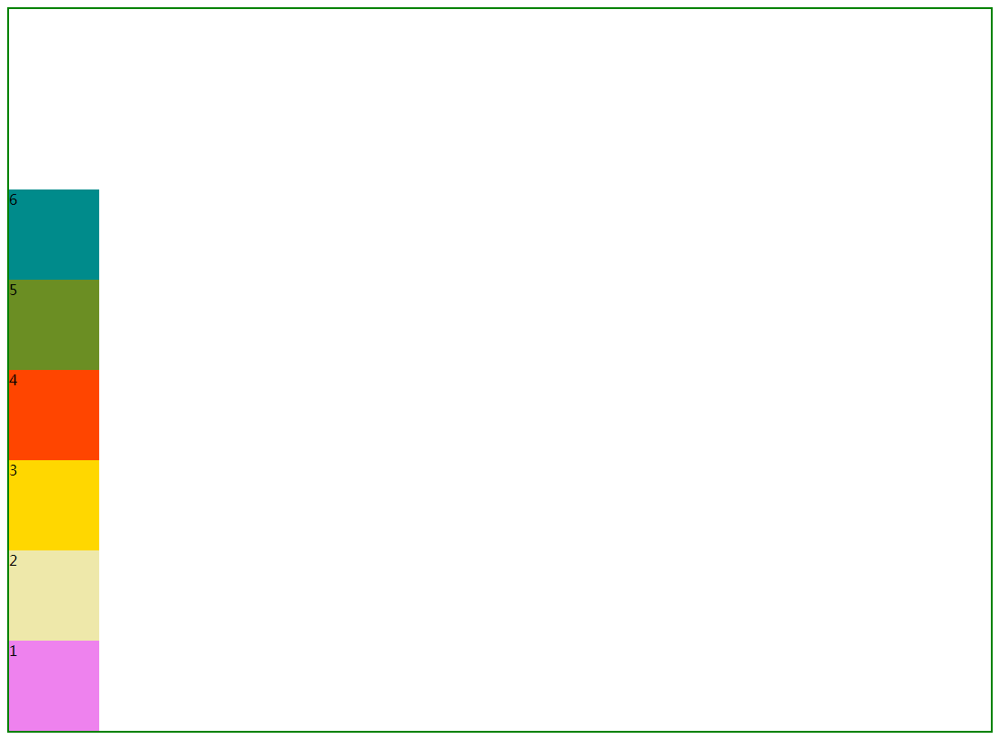

## 弹性盒布局

也叫弹性布局、弹性盒子、flex布局、伸缩布局、伸缩盒子。

弹性盒子是一种简单、强大的布局方式。通过弹性盒子可以指明空间的分布方式、内容的对齐方式、元素的视觉顺序。弹性盒子最适合用于沿着一个方向进行内容的分配。


最大特点：让元素对不同屏幕尺寸和不同显示设备做好适应准备。


弹性布局：`父-》子关系`。父元素和子元素之间的关系。

父元素：弹性空间或弹性容器。

子元素：弹性项或弹性元素。


#### 弹性容器

弹性容器属性比较多，经常用到的属性也是弹性容器上的属性。


父元素上直接设置`display:flex`就已经激活了弹性盒子布局。这个元素就成为了弹性元素。

弹性容器负责在所占的空间内布置子内容，控制子内容的布局。


父元素设置了`display:flex`，子元素横向排列（而且不塌陷）。并且当父元素宽度小于这些子元素的总宽度的时候回自动伸缩。

```html
<!DOCTYPE html>
<html>

<head>
    <style>
        #f {
            border: 2px solid green;

            display: flex;
        }

        #f div {
            width: 100px;
            height: 100px;

        }

        #f div:first-of-type {
            background-color: violet;
        }

        #f div:nth-of-type(2) {
            background-color: palegoldenrod;
        }

        #f div:nth-of-type(3) {
            background-color: gold;
        }

        #f div:nth-of-type(4) {
            background-color: orangered;
        }

        #f div:nth-of-type(5) {
            background-color: olivedrab;
        }

        #f div:nth-of-type(6) {
            background-color: darkcyan;
        }
    </style>
</head>

<body>
    <div id="f">
        <div>1</div>
        <div>2</div>
        <div>3</div>
        <div>4</div>
        <div>5</div>
        <div>6</div>
    </div>
</body>

</html>
```

#### 弹性元素

弹性容器的子元素称为弹性元素（只有直接子元素使用弹性布局，子元素的后代不受影响）

弹性容器的直接子元素是弹性元素，弹性元素也可以作为弹性容器。


在弹性容器中，各个弹性元素排在主轴的上。主轴可以是横向的也可以是纵向的。


主轴：内容沿着此轴开始流动。指明弹性元素的流动方向。默认主轴是水平方向，左边开始、右边结束。

垂直轴（交叉轴、侧轴、辅轴）：弹性元素沿着此轴开始堆叠，指明新弹性元素行的方向。默认的时候垂直轴是从上面开始、下面结束。__垂直轴始终与主轴垂直。__


#### 设置主轴方向

`flex-direction`属性用来指定在弹性容器中如何摆放弹性元素，从主轴的起始边开始，流向主轴的结束边。

格式：`flex-direction`，用于弹性容器。

* row，起始边在弹性容器左边，结束边在弹性容器右边。默认值。（相当于左浮动的效果。）
* row-reverse，主轴的起始边在弹性容器的右边，结束边在弹性容器的左边。（相当于右浮动的效果）
* column，主轴的起始边在弹性容器的上边，结束边在弹性容器下边。垂直轴变为横向。从左边开始，右边结束。
* column-reverse，主轴的起始边在弹性容器下边，结束边在弹性容器上边。垂直轴变为横向。从左开始，右边结束。


__注意：__

当给弹性容器设置高度的时候，高度如果超出子元素的总和，那么父元素多出来的空间将会放在主轴的结束边。




```html
<!DOCTYPE html>
<html>

<head>
    <style>
        #f {
            border: 2px solid green;

            display: flex;
            /* flex-direction: row-reverse; */
            flex-direction: column-reverse;

            height:800px;
        }

        #f div {
            width: 100px;
            height: 100px;

        }

        #f div:first-of-type {
            background-color: violet;
        }

        #f div:nth-of-type(2) {
            background-color: palegoldenrod;
        }

        #f div:nth-of-type(3) {
            background-color: gold;
        }

        #f div:nth-of-type(4) {
            background-color: orangered;
        }

        #f div:nth-of-type(5) {
            background-color: olivedrab;
        }

        #f div:nth-of-type(6) {
            background-color: darkcyan;
        }
    </style>
</head>

<body>
    <div id="f">
        <div>1</div>
        <div>2</div>
        <div>3</div>
        <div>4</div>
        <div>5</div>
        <div>6</div>
    </div>
</body>

</html>
```

#### 换行

弹性元素在弹性容器的主轴放不下，默认情况下弹性元素不会换行。


格式： `flex-wrap:value`来控制换行。

* nowrap，默认时沿着主轴在一行上面排列，不会换行。

* wrap，沿着垂直轴的方向换行。

  当给弹性容器设置高度的时候，那么如果换行的每一行有多余空间将会放在每一行的顶端

  

* `wrap-reverse`，如果超过弹性容器，将会沿着垂直轴的方向反向进行换行。


#### 弹性元素如何在主轴上分布。

默认的情况下，弹性容器中放下所有的弹性元素后留下的空白始终出现在主轴的结束边。

`justify-content`属性来设置弹性容器主轴上面的各行里面的各个弹性元素怎么获得多余的空间。

* flex-start，弹性元素紧靠主轴的起始边。

* flex-end，弹性元素紧靠主轴的结束边。（有点像`text-align:right`）。

* center，将弹性元素作为一个整体，居中显示在主轴的中点。

* space-between

  

  将每一行里的第一个弹性元素放在主轴起始边、每一行的最后一个弹性元素放在主轴结束边，余下的每一对相邻的弹性元素之间放置等量的空白。

* space-around

  

  将余下的空间除以改行的弹性元素的个数，得到的空间除以2分别放在元素的左边和右边。

* space-evenly

  计算弹性元素的数量，在此基础上加上一个1，然后将一行里面的空间分成`元素个数+1`之后的份数。一行里面的每个弹性元素都会放置一份空间，最后一份放置在最后一个弹性元素的后面。

  

  比如宽度为810px，总共6个元素，每个100px。（810-600=210）/ 6+1(7) = 30px

  __即使一行放不下，下一行也会按照这种方式来进行划分空白。__

  

  

  #### 设置弹性元素如何在垂直轴上分布

  align-items定义弹性元素在垂直方向上的对齐方式。

  `align-items:value`

  * flex-start，将各个弹性元素与弹性容器垂直轴的起始边那一侧对齐。

  * flex-end，将各个弹性元素与弹性容器垂直轴的结束那一侧对齐。

    

  * center，弹性元素的中点与所在行的垂直轴的中点对齐。

    

  * stretch，默认值。如果弹性元素没有设置高度或高度设置为auto，将占满整个哪一行的高度。

    

    如果想单独的设置某个弹性元素的对齐方式可以在相应的弹性元素上使用`align-self`。（弹性元素上）

    `align-self`

    * auto，默认值。继承自弹性容器的align-items的值。
    * flex-start
    * flex-end
    * center
    * stretch

    

  #### 设置整个弹性元素如何对齐

  align-items对单行的弹性盒子模型无效。（flex-wrap:nowrap）

  `align-items`是每行怎么垂直对齐。`align-content`将整个子元素看成一个整体，然后相对于弹性容器来进行对齐。

  * flex-start，弹性元素紧靠垂直轴起始边。

    

  * flex-end，弹性元素紧靠垂直轴结束边。

  * center，将弹性元素作为一个整体，垂直居中显示在垂直轴的中点。

    

  * space-between

    

  * space-around

    

  * space-evenly

    

  * stretch

  

  __align-content和align-items区别在于align-content将所有元素看成一个整体然后进行操作，align-items针对每一行的操作。__

  __align-content存在时align-items不起作用。__

  

  #### 弹性增长因子

  上面的属性除了`align-self`其他的都是在父元素上设置的。

  `flex-grow`，适用于弹性元素（子元素上设置），用来定义有多余的空间时是否允许弹性元素增大，以及允许增大的比例。

  

  默认值是0。其他值始终是数字，负数无效。可以是小数。

  ```html
  <!DOCTYPE html>
  <html>
  
  <head>
      <style>
          #f {
              border: 2px solid green;
  
              display: flex;
              width: 750px;
              height: 100px;
              align-items: flex-start;
  
          }
  
          #f div {
              width: 100px;
              height: 100px;
  
          }
  
          #f div:first-of-type {
              background-color: violet;
          }
  
          #f div:nth-of-type(2) {
              background-color: palegoldenrod;
          }
  
          #f div:nth-of-type(3) {
              align-self: flex-end;
              background-color: gold;
          }
  
      </style>
  </head>
  
  <body>
      <div id="f">
          <div>1</div>
          <div>2</div>
          <div>3</div>
      </div>
  </body>
  
  </html>
  ```

  上面的例子因为flex-grow为0所以各个部分都不允许放大。

  ```html
  <!DOCTYPE html>
  <html>
  
  <head>
      <style>
          #f {
              border: 2px solid green;
  
              display: flex;
              width: 750px;
              height: 100px;
              align-items: flex-start;
  
          }
  
          #f div {
              width: 100px;
              height: 100px;
  
          }
  
          #f div:first-of-type {
              background-color: violet;
          }
  
          #f div:nth-of-type(2) {
              background-color: palegoldenrod;
          }
  
          #f div:nth-of-type(3) {
              align-self: flex-end;
              background-color: gold;
          }
  
      </style>
  </head>
  
  <body>
      <div id="f">
          <div>1</div>
          <div style="flex-grow:1;">2</div>
          <div>3</div>
      </div>
  </body>
  
  </html>
  ```

  上面的例子总共剩余450px分成了一份，这一份给到了div 2，这个时候即使div2有宽度也会覆盖变成了550px;

  

  #### 弹性元素排序

  默认时，弹性元素的显示和排序顺序与在源码中出现顺序一致。order属性可以用于修改单个弹性元素的显示顺序。

  `order:value`用在弹性元素上。

  默认情况下，所有的弹性元素都是0。可以将order设置为其他的非零的整数（正数、负数）。

  order的数值越大在主轴上越靠后。如果数值相同则归在一个排序组中，以出现在源码中的顺序沿着主轴方向显示。

  

  注意：只是视觉上的变化，__就像__在源代码中的顺序变了一样。（但实际上没变）

  

#### 收缩因子

`flex`元素在默认宽度之和大于容器的时候会发生收缩，收缩的依据是`flex-shrink`，并且收缩的时候压缩的最小宽度不能小于内容的宽度。


格式：`flex-shrink`，写在弹性元素。缩减（收缩）因子定义的空间不够的时候放置所有弹性元素应该怎么减。（应该怎么补足缺少的空间）。


flex-shrink的默认值是1，其他值也得是数字，负数无效。可以是小数（只要大于0就行）。

```html
<!DOCTYPE html>
<html>

<head>
    <style>
        #f {
            border: 2px solid green;

            width: 750px;
            height: 100px;
            display: flex;


        }

        #f div {
            width: 300px;
            height: 100px;
            /* 有点赖皮，欠150px，谁也不还，谁也不减少。 */
            flex-shrink: 0;
        }

        #f div:first-of-type {
            background-color: violet;
        }

        #f div:nth-of-type(2) {
            background-color: palegoldenrod;
        }

        #f div:nth-of-type(3) {
            background-color: gold;
        }
    </style>
</head>

<body>
    <div id="f">
        <div>1</div>
        <div>2</div>
        <div>3</div>
    </div>
</body>

</html>
```

上面的代码将会导致超出。为0的话表示各个部分都不允许缩小，所以会超出弹性容器。

```html
<!DOCTYPE html>
<html>

<head>
    <style>
        #f {
            border: 2px solid green;

            width: 750px;
            height: 100px;
            display: flex;


        }

        #f div {
            width: 300px;
            height: 100px;
            /* 每个弹性元素都会进行相应的缩减 */
            
            flex-shrink: 1;
        }

        #f div:first-of-type {
            background-color: violet;
        }

        #f div:nth-of-type(2) {
            background-color: palegoldenrod;
        }

        #f div:nth-of-type(3) {
            background-color: gold;
        }
    </style>
</head>

<body>
    <div id="f">
        <div>1</div>
        <div>2</div>
        <div>3</div>
    </div>
</body>

</html>
```

`#f`弹性容器总共缺少150px，缺少的这150分成了3份。每个元素都占据一份，一分为50px，所以每个元素都将在原有的基础上缩减50px。

```html
<!DOCTYPE html>
<html>

<head>
    <style>
        #f {
            border: 2px solid green;

            width: 750px;
            height: 100px;
            display: flex;


        }

        #f div {
            width: 300px;
            height: 100px;

        }

        #f div:first-of-type {
            background-color: violet;
        }

        #f div:nth-of-type(2) {
            background-color: palegoldenrod;
        }

        #f div:nth-of-type(3) {
            background-color: gold;
        }
    </style>
</head>

<body>
    <div id="f">
        <div style="flex-shrink:0.7;">1</div>
        <div style="flex-shrink:0.8;">2</div>
        <div style="flex-shrink: 1;">3</div>
    </div>
</body>

</html>
```

上面#f缺少150px，分成了2.5份（`0.7+0.8+1`），div1占据了`0.7/2.5（0.28）`减少了`42px=258`，div2占据了`0.8/2.5(0.32)`减少了`48px=252`，div3占据了`1/2.5（0.4）`减少了`60px=240`。